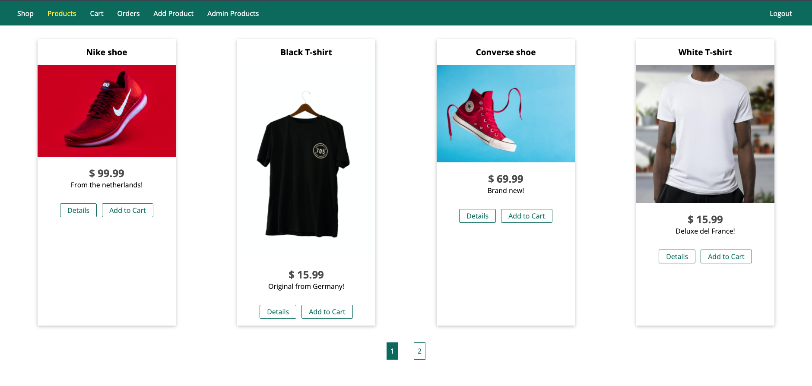
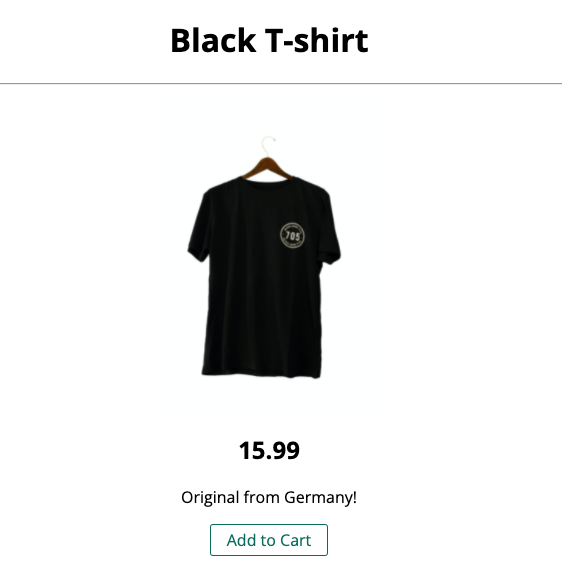
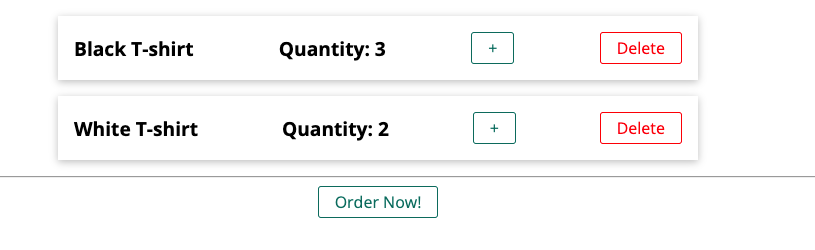
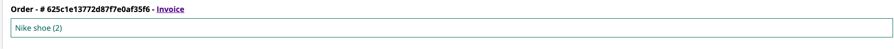
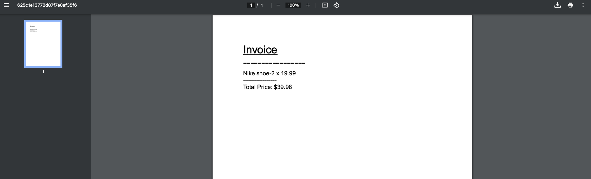
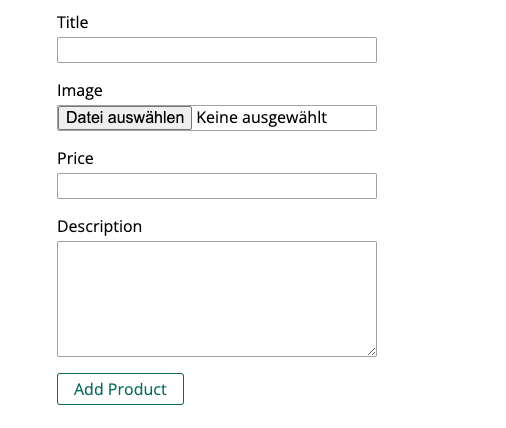
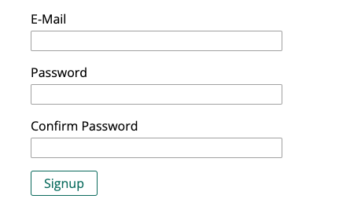

# A nodejs based Online Shop.

Deployed on Heroku: 
https://node-app-martin.herokuapp.com/

Topics: Authentication, authorization, validation mongo database connection, template engine (ejs), cookies, sessions, multi-file upload, generate pdf on the fly, using 3rd party packages to send emails to clients, checkout process with Stripe. 

## IMPORTANT NOTE: 
Checkout process with **Stripe** is disabled! The neccessary Production API key is deactivated otherwise it would work like a usual checkout proccess in a common online shop.

## Previews

### Products:

### Individual Product:

### Shopping Cart:

### Order:

### Custom invoice with pdf creator: 

Just a test - not professional. Open inline in the browser after clicking on the invoice link. 

### Add a product:

### Signin and receive a success email

